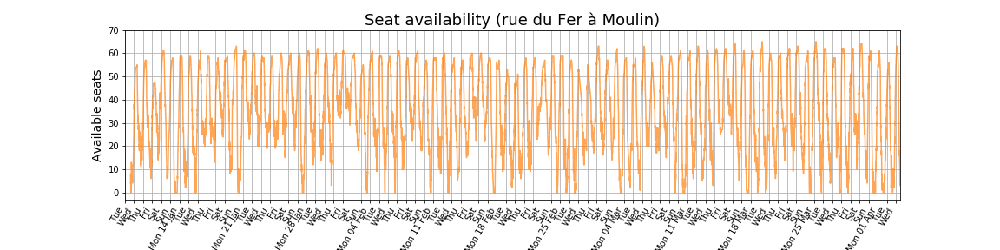
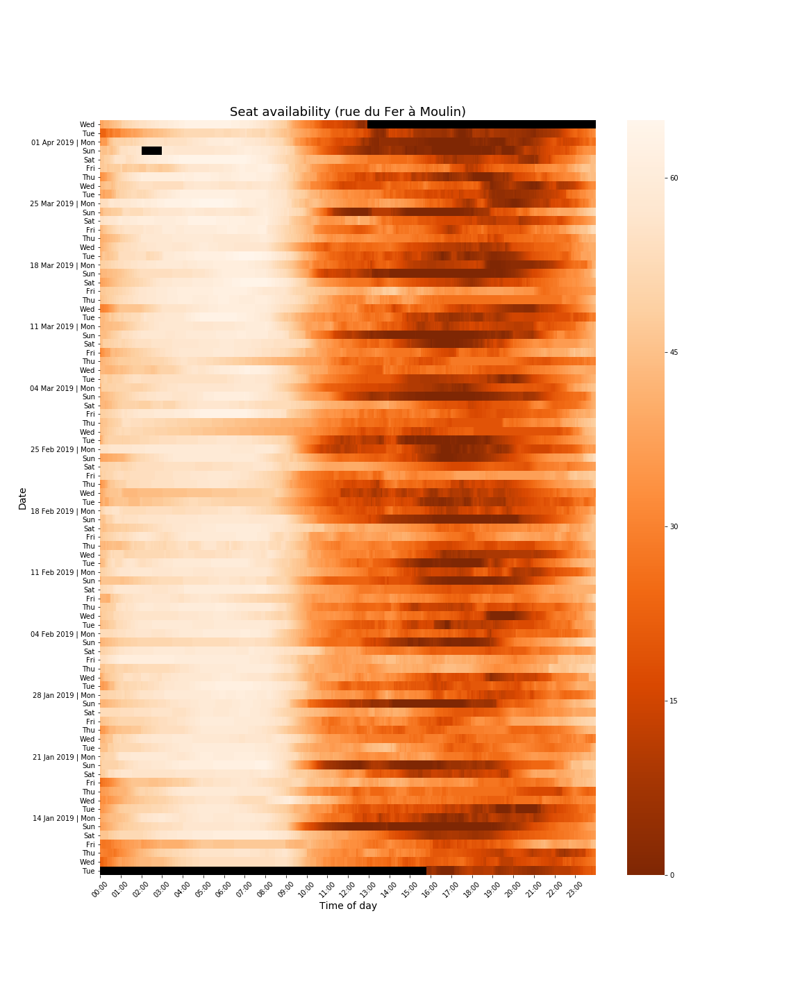
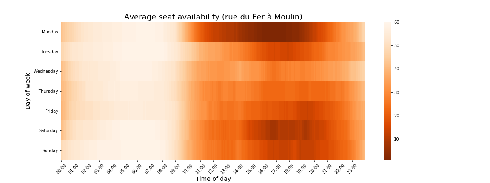
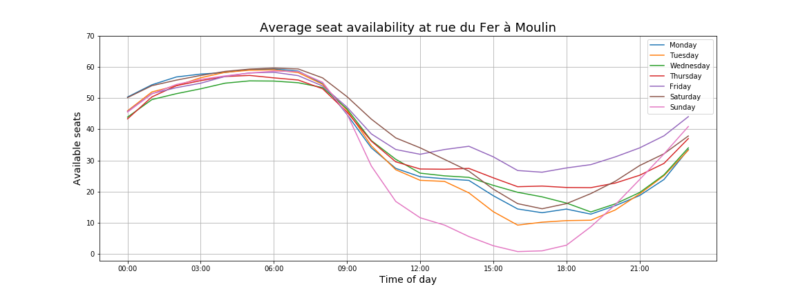
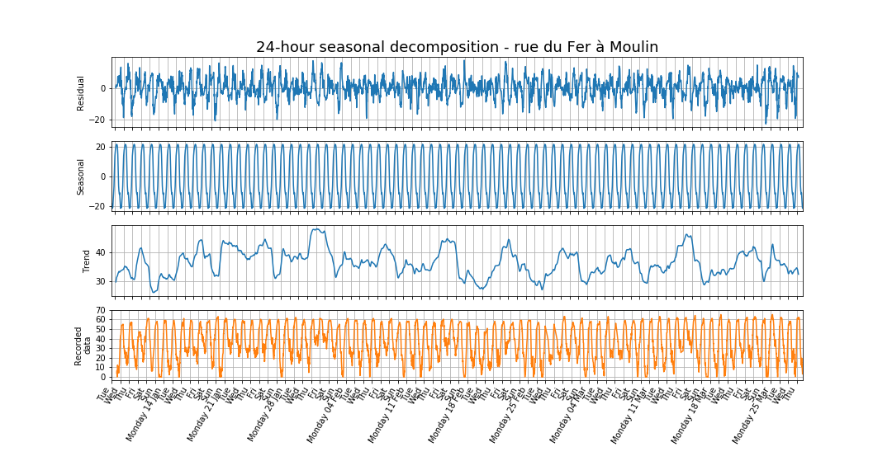
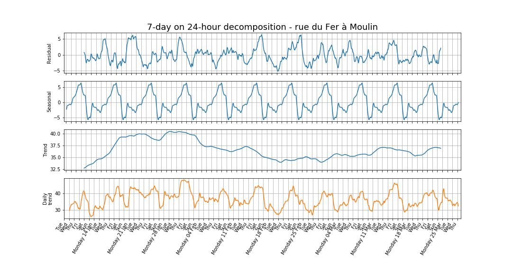
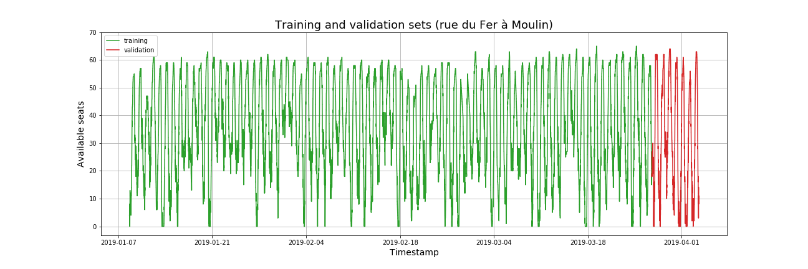
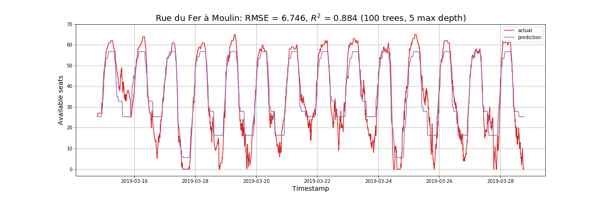
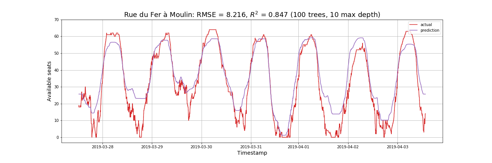
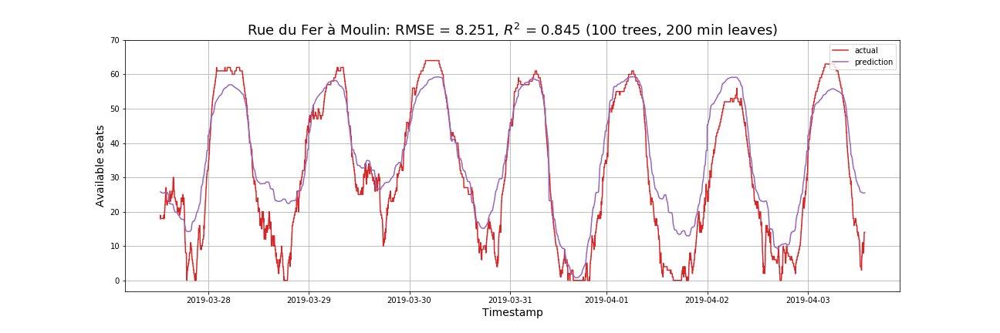

# Seat availability at *La Permanence* coworking spaces #

[La Permanence](https://www.la-permanence.com "La Permanence coworking
space in Paris") offers two coworking spaces in Paris, in *rue du
Fer à Moulin* and *rue d'Alésia*.

## Goals
Our goals are to **model** and **forecast** the number of available
seats at the locations.  

## The data
Both locations are open 24/7 and the number of available seats is
posted in real time on their website.  The data has been collected (at
irregular but frequent intervals) since mid-January 2019.

The data is saved in `attendance.csv` (a misnomer, since it records
the number of *available* seats rather than the number of seats used).
It consists of three columns:  

1. `timestamp`: date and time of collection of data (in the **UTC**
     standard).  The format is `YYYY-MM-DD-hh-mm-ss` with `YYYY=`year,
     `MM=` month, `DD=` day, `hh=` hour, `mm=`minute, `ss=` second    
1. `Moulin`: number of available places at *rue du Fer à Moulin*  
1. `Alésia`: number of available places at *rue d'Alésia*  

The dataset is also [available on
kaggle](https://www.kaggle.com/antoinechoffrut/la-permanence-attendance).  

## Scripts
1. The script `la-permanence-scraping.py` collects the data.   

## Notebooks
1. The Jupyter Notebook `la-permanence-understanding.ipynb` is a very
   brief presentation of the dataset and its format.  
1. The Jupyter notebook `la-permanence-seasonality.ipynb` investigates
   the double seasonality in the data.
1. The Jupyter notebook
   `la-permanence-random-forests-forecasting.ipynb` illustrates the
   effectiveness of using random forests to forecast  the
   availability of seats at the coworking spaces.   The model used in
   this notebook is the result of extensive exploration into which
   features from the data to feed the model and which values to select
   for its parameters.  This is done in other notebooks.  
1. The Jupyter notebook
   `la-permanence-random-forsts-feature-importance.ipynb` examines
   which features to use in the model.  
1. The Jupyter notebook
   `la-permanence-random-forests-parameters.ipynb` examines how the
   parameters in the model effects its performance.  
1. The Jupyter notebook `la-permanence-decision-trees.ipynb` explores
   how the parameters affect the inner structure of decision trees.  

# Findings

Below we incorporate the most salient conclusions of the project as it
moves along.

## Alternative visualization via heatmaps
We can generate a different visualization of the data as a heatmap:

  

The black cells represent missing data:  
- data is missing at the beginning of the first day of data collection;  
- data is missing for the remainder of the last day of data collection;  
- France switched to daylight saving time on Sun 31 Apr 2019 at 2am.  

## Taking averages
A simple forecasting method consists in taking averages.  A validation
set is obtained by taking the last week of data, the rest being the
training set.  In the figure below, the green cloud represents the
data from the training data, one week superposed on another; the black
curve represents their averages; and the red curves represent the last
week of data in the set (straddling over two weeks, hence split).  

  

This plot gives some visual evidence that the training data is well
represented by its average.  The deviation seems to be due to a few
outlying values (some of which are actually interpolated values
replacing missing data).  The validation set turns out to be quite
distinct from the previous weeks.  

Below we show the average data in a heatmap.  

  

## Seasonality
Taking averages is a very simple model.  It does not have any memory
nor does it attempt to exploit inherent structure in the data.  A more
refined model would possibly require to analyze the seasonal behavior
in the data, which it is easily expected to contain.  Indeed, the
following figure clearly shows that each day of the week has a
distinct pattern.  

In fact, this figure shows that the timeseries exhibits seasonality of
multiplicity two: there is a 24-hour as well as a 7-day seasonality.  
We can analyze this in more detail by first performing a 24-hour
seasonal decomposition on the original time-series, as shown in the
figure below.  

Note how the 7-day seasonality is retained in the trend resulting from
this first decomposition.  Thus we perform a second, 7-day seasonal
decomposition on this trend as illustrated in the figure below.

 

## Random forests
We use random forests to predict seat availability at the coworking
spaces for the next two weeks.  

### Choosing the features
Since the data consists of pure time-series, we first need to
determine categorical features.  

Taking a hint from our seasonal decomposition, it is natural to
select:  
- a feature capturing the 24-hour seasonality;  
- a feature capturing the 7-day seasonality; and  
- a feature capturing the (global) trend.  
Thus, with our data currently being from the same quarter of the same
year, we may think of taking:    
- the minute of day to capture the 24-hour seasonality;  
- the day of the week to capture the 7-day seasonality; and  
- any temporal feature of larger scale such as the week.  
However, random forests have no ability to extrapolate into the future
and therefore a third feature is unlikely to prove useful at all.  In
fact, from experience using more features, or features other than the
minute of day and the day of week, generally worsens the performance
of the method.  

**Note.** The two features of the minute of day and the day of week
can be combined into the minute of week.

**Conclusion.**  We are only using the features *minute of day*  and
*day of week*.  In this case, each decision tree is likely to
reproduce the average data, and indeed this is what we observe.  

Nevertheless, exploring the method with pure timeseries has proved an
interesting exercise and allows us to understand better how random
forests behave.  

### Setting the model's parameter
Random forests have many parameters and it can be quite daunting to
determine how to select them.  
- The number of trees over which the random forest takes averages to
  produce its outcome.  The larger this number, the more stable (hence
  reliable) the results.  Taking 100 trees produce consistent
  results.  
- The minimum number of samples in a leaf.  
- The maximum depth in the trees.  

Either the minimum number of samples in a leaf or the maximum depth in
the tree can be prescribed, but not both at the same time.  While
optimal values for either of these parameters can be found after trial
and error, it would be interesting to understand why these values
produce optimal results.  This is a question for further
investigation. 

### Training and validation sets
The following figure shows the splitting between training and
validation data for the location at rue du Fer à Moulin.

### Random forests with maximum depth prescribed
The performance of the random forest is measured by the root mean
squared error (RMSE) and $R^2$ score.

Let's first look at the results with a maximum depth of 5.  

  

The predictions have the appearance of a discretized signal.  This is
actually not at all surprising.  Indeed, with a maximum depth of 5,
each tree can only output a maximum of 32 values, while the maximum
number of seats at the location is 63.  On the other hand, a random
forest takes averages of several decision trees (here 100), and thus
this averaging should produced more intermediate values.  This is not
what we observe in the graph.  The explanation is probably to be found
in the original signal (data) itself, which has quite a lot of
regularity.  This suggests that the trees of a random forest produce
nearly the same results.  In fact, experimenting with the number of
trees does not seem to make any changes, and using 5 trees (rather
than 100) produces the same result.

Furthermore, the random forest is quite effective during the fast
transition periods and not so good when availability is either low or high.  

Increasing now the maximum depth to 10 improves the predictions at low
and high availability.  

  

### Random forests with minimum number of samples per leaf prescribed
For completeness we provide the results of fixing the other parameter
`min_samples_leaf` in the model.  A near optimal value yields a
comparable performance.  

## Conclusions on the method of random forests
We have implemented the simplest model of random forests and the
results ended up being the same as taking averages.  This is because
the features used do not extract information from the past: the method
does not have any memory.  

A more sophisticated approach would be to incorporate information from
the past into additional features.  This has limitations: if one
wishes to make predictions for the next week, say, then this information
must be taken at least one week prior to each record, which maybe to
long.  

Other external features can be included in the model, the most obvious
of which is the weather.  
