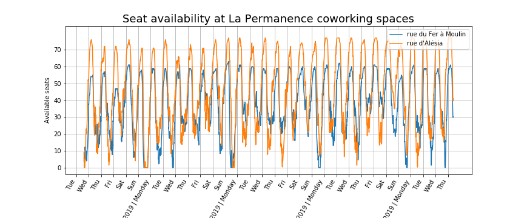
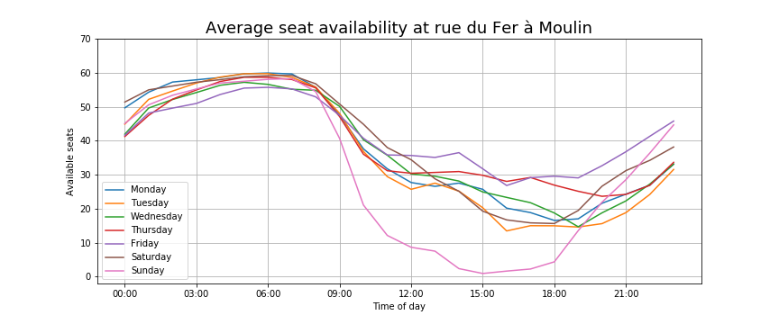
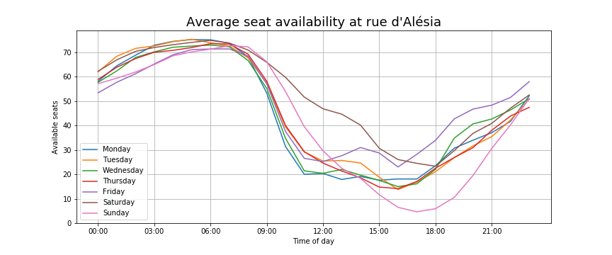

# Seat availability at *La Permanence* coworking spaces #

*(Last update: 7 Feb 2019)*

[La Permanence](https://www.la-permanence.com "La Permanence coworking
space in Paris") offers two coworking spaces in Paris, in *rue du
Fer à Moulin* and *rue d'Alésia*.
They are open 24/7 and the number of available seats is posted real time on their website

## Goals
Our goals are to **model** and **forecast** the number of available
seats at the locations.

## Preliminary results
The dataset is still relatively small and this project is work in
progress.  Here we relay initial observations.  

The timeseries exhibits seasonality of multiplicity two: there is a
24-hour as well as a 7-day seasonality.  It makes thus sense to take
averages for each day of the week.

The patterns appear to be somewhat different at the two locations.
At rue du Fer à Moulin, Sunday is set apart from all other days of
the week (inclucing Saturday) in that attendance in the afternoon is
higher. 
At rue d'Alésia, weekdays exhibit similar patterns, Saturday has less
attendance and Sunday later afternoon the most.

## The dataset
The data is saved in `attendance.csv` (a misnomer, since it records
the number of *available* seats rather than the number of seats used).
It consists of three columns:  

1. `timestamp`: date & time of collection of data (in the **UTC**
     standard).  The format is `YYYY-MM-DD-hh-mm-ss` with `YYYY=`year,
     `MM=` month, `DD=` day, `hh=` hour, `mm=`minute, `ss=` second    
1. `Moulin`: number of available places at *rue du Fer à Moulin*  
1. `Alésia`: number of available places at *rue d'Alésia*  

The dataset is also [available on
kaggle](https://www.kaggle.com/antoinechoffrut/la-permanence-attendance).  

## Scripts and notebooks
`

1. The script `la_permanence_scraping.py` collects the data every
     minute (most of the time).   
1. The Jupyter Notebook `la_permanence_EDA.ipynb` performs simple
   operations on the data to gain preliminary understanding.  The
   figures above, for example, are generated in
   `la_permanence_EDA.ipynb`. 
1. The Jupyter notebook `la_permanence_stats.ipynb` aims to apply
   various statistical or Machine Learning algorithms to predict the
   number of available seats.
