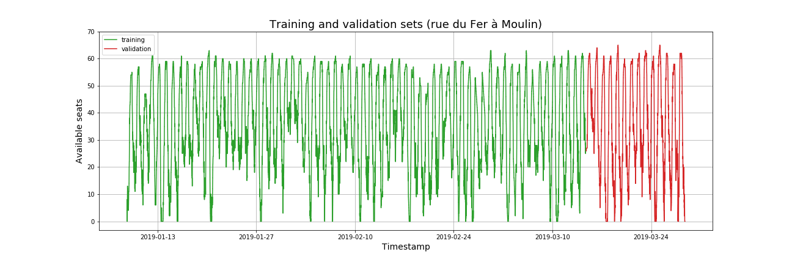
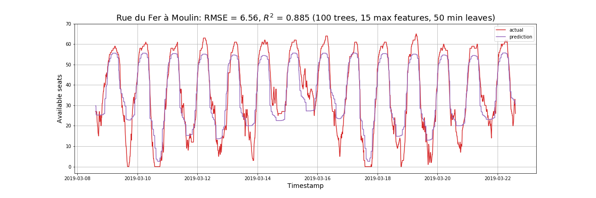
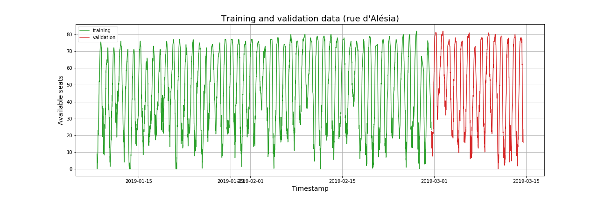
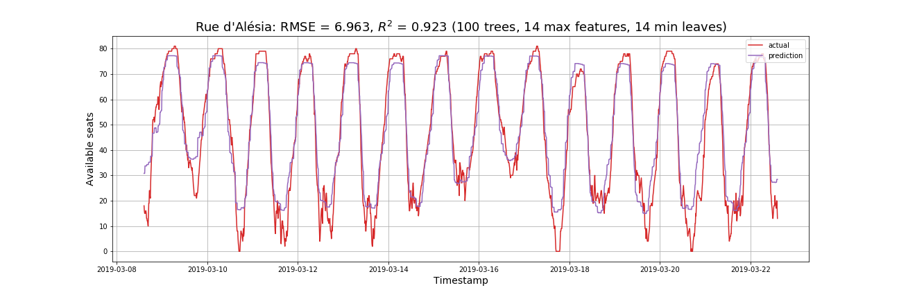

# Seat availability at *La Permanence* coworking spaces #

[La Permanence](https://www.la-permanence.com "La Permanence coworking
space in Paris") offers two coworking spaces in Paris, in *rue du
Fer à Moulin* and *rue d'Alésia*.

## Goals
Our goals are to **model** and **forecast** the number of available
seats at the locations.  

## The data
Both locations are open 24/7 and the number of available seats is
posted in real time on their website.  The data has been collected (at
irregular but frequent intervals) since mid-January 2019.

Below we incorporate the most salient conclusions of the project as it
moves along.

## Time series analysis with random forests

The notebook `la-permanence-random-forests.ipynb` investigates the
effectiveness of random forests in forecasting seat availability at
the coworking spaces.  To this end the timestamp has been expanded
into 16 features.  

The following figure shows the splitting between training and
validation data for the location at rue du Fer à Moulin.

The following figure shows a two-week forecast using random forests
at rue du Fer à Moulin.  

 

Similarly, the training and validation sets at rue d'Alésia:

and the two-week forecast:

 

In conclusion, random forests are quite good at
picking up the general trend but not quite as good in detecting
particularly high attendance (low availability)

## Multiple seasonality
The timeseries exhibits seasonality of multiplicity two: there is a
24-hour as well as a 7-day seasonality.  It makes thus sense to take
averages for each day of the week.

The patterns appear to be somewhat different at the two locations.
At rue du Fer à Moulin, Sunday is set apart from all other days of
the week (inclucing Saturday) in that attendance in the afternoon is
higher. 
At rue d'Alésia, weekdays exhibit similar patterns, Saturday has less
attendance and Sunday later afternoon the most.  

The Jupyter notebook `la-permanence-seasonality.ipynb` investigates
the seasonality in the data in further detail.  

## The dataset
The data is saved in `attendance.csv` (a misnomer, since it records
the number of *available* seats rather than the number of seats used).
It consists of three columns:  

1. `timestamp`: date and time of collection of data (in the **UTC**
     standard).  The format is `YYYY-MM-DD-hh-mm-ss` with `YYYY=`year,
     `MM=` month, `DD=` day, `hh=` hour, `mm=`minute, `ss=` second    
1. `Moulin`: number of available places at *rue du Fer à Moulin*  
1. `Alésia`: number of available places at *rue d'Alésia*  

The dataset is also [available on
kaggle](https://www.kaggle.com/antoinechoffrut/la-permanence-attendance).  

## Scripts
1. The script `la-permanence-scraping.py` collects the data.   

## Notebooks
1. The Jupyter Notebook `la-permanence-EDA.ipynb` performs simple
   operations on the data to gain preliminary understanding.  
1. The Jupyter notebook `la-permanence-random-forests.ipynb`
   investigates the effectiveness of using random forests to forecast
   the availability of seats at the coworking spaces.  
1. The Jupyter notebook `la-permanence-seasonality.ipynb` investigates
   the seasonality in the data.
